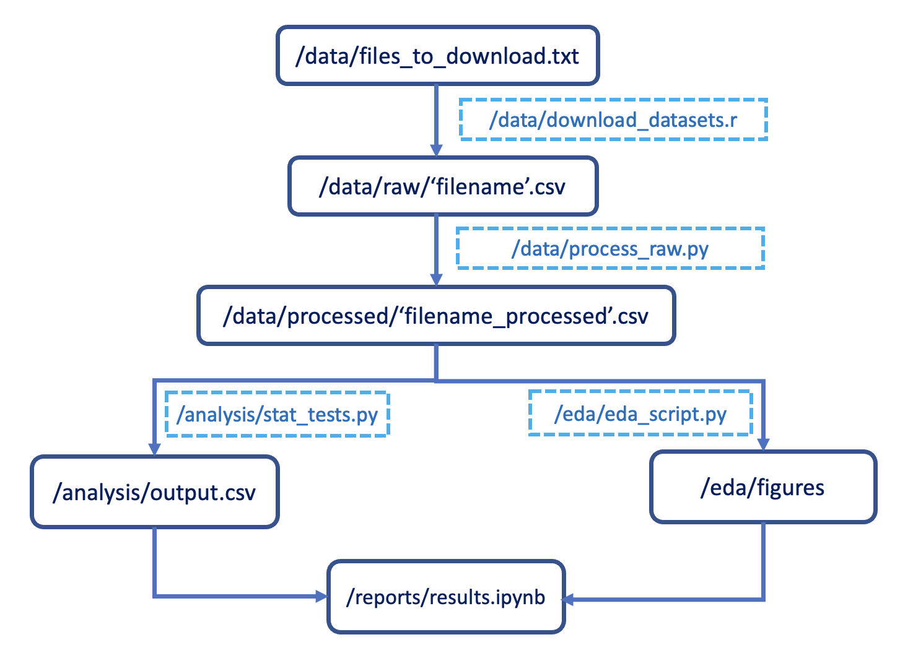

# Covid Reddit Behaviour

Contributors: Luke Collins, Mel Liow, Nobby Nguyen, Maeve Shi

## Summary

Here we attempt to look into the [reddit mental health dataset](https://zenodo.org/record/3941387#.YZl5BC1h1QL) from which we have selected 15 mental-health-specific subreddit datasets. These datasets contain collections of reddit user posts from 2018-2020. We aim to find the impact of COVID-19 on mental health support groups by looking into the data before and after the pandemic. Specifically, we aim to focus the question:  

> Has frequency of explicit description of substance abuse in mental-health-oriented subreddits changed over the time period of 2018 through 2020.

For the first week, we conducted exploratory data analysis on 30 datasets (15 mental subreddits, each with a self-described 'pre' and 'post' pandemic dataset), which can be found [here](https://github.com/UBC-MDS/covid_reddit_behaviour/tree/eda/eda/subreddit). The exploratory data analysis mainly focus on these parts:

- Features: We explored the features in details by the [published paper](https://www.jmir.org/2020/10/e22635/.) and decided to only include `substance_use_total`, `subreddit`, `author`, `date`, `post`, and exclude all other features, because they are the only ones relevant to the question. 

- High Level Analysis: We checked if there's any missing values in datasets, as well as what needs to be cleaned. Then we concatenated the pre and post data set to see the difference of descriptive variables.  

- Visualization: We showed the plot of `substance_use_total` distribution before and after the covid to gain a better understanding of our question. 


## Dataset

The datasets we used contain reddit user posts and text-derived metrics (e.g. the `substance_use_total` feature) from 15 mental health subreddits: r/EDAnonymous, r/addiction, r/alcoholism, r/adhd, r/anxiety, r/autism, r/bipolarreddit, r/bpd, r/depression, r/healthanxiety, r/lonely, r/ptsd, r/schizophrenia, r/socialanxiety, and r/suicidewatch.

Timeframe of datasets: 

- 'post' [pandemic]: Jan 1 to April 20, 2020 (called "mid-pandemic" in manuscript; r/COVID19_support appears). Unique users: 320,364. 
- 'pre' [pandemic]: Dec 2018 to Dec 2019. A full year which provides more data for a baseline of Reddit posts. Unique users: 327,289.

More information can be found [here](https://zenodo.org/record/3941387#.YZl5BC1h1QL)

## Report
Our final report can be found [here](https://ubc-mds.github.io/covid_reddit_behaviour/introduction.html)

## Usage
To replicate the analysis, all relevant scripts will be made available in this GitHub repository. All necessarily dependencies will be provided and commands required to fetch the relevant data will be provided as follow.
Please run the following commands at the command line/terminal after cloning the GitHub repository to your machine.

Install our conda environment:
```console
conda env create -f env.yaml
conda activate covid_reddit_behaviour
```

*Note for Windows users*:
In addition to the environment setup above, you will be required to run the script below to ensure that `Altair` can save figures.

```console
npm install -g vega vega-cli vega-lite canvas
```

1. Run the following scripts from the project's root directory:

1.1 Run either of the following scripts to download the dataset
Using python:
```console
$ python src/download_datasets.py [<output_directory>]
```

Or, using R:
```console
$ Rscript src/download_datasets.r [<output_directory>]
```

1.2. Process the raw data by running the following script:
```console
$ python src/process_raw.py --in_dir='data/raw/' --out_dir='data/processed/'
```

1.3. Run statistical tests by running the following script:
```console
$ python src/stat_tests.py --data_path='data/processed/' --output='analysis/stat_tests/stat_tests.csv'
```

1.4. Create EDA diagrams by running the following script:
```console
$ python src/eda_script.py --data_path='data/processed/' --output='eda/figures/'
```

2. Build and view the report using Jupyter book:
```console
jupyter-book build reports
```

### Workflow summary
The workflow of our analysis is illustrated in the flowchart below.


## License
The source code for the site is licensed under the MIT license, which you can find [here](https://github.com/UBC-MDS/covid_reddit_behaviour/blob/main/LICENSE).
## References
Low D, Rumker L, Talkar T, Torous J, Cecchi G, Ghosh S  
Natural Language Processing Reveals Vulnerable Mental Health Support Groups and Heightened Health Anxiety on Reddit During COVID-19: Observational Study  
Journal of medical Internet research, 22(10), e22635.
